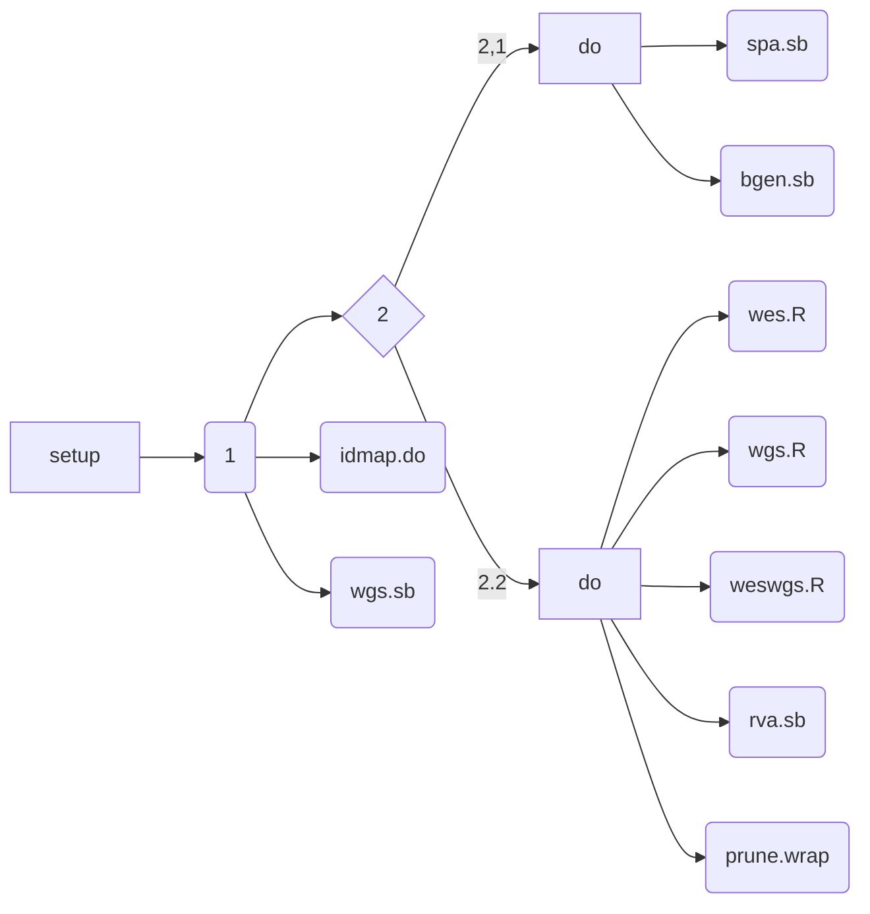

## Programs

| Sequence | Filename  | Description           |
| ---------|---------- | --------------------- |
| 1        | weswgs.sh | WES/WGS preprocessing |
| 2.1      | rva.sh    | Rare-variant analysis |
| 2.2      | spa.sh    | Single-point analysis |

idmap.do, ngs.wrap, weswgs.R, prune.wrap, rva.sb, spa.sb are subprograms; and remarks on variant lists and results submitted centrally are described in INTERVAL.md.

The natural order is therefore

[ and also [README.pdf](README.pdf) or https://jinghuazhao.github.io/SCALLOP-Seq/.

Note in particular that sbatch implicates the --wait option as the succeeding steps would require its full results. It would need change spa.sb in
the number of array jobs and function to call in order to accommodate software (BOLT-LMM/GCTA --fastGWA) and model (mixed model/linear regression).

## Contacts

* Grace Png: grace.png@helmholtz-muenchen.de
* Arthur Gilly: arthur.gilly@helmholtz-muenchen.de

## Slack channel

* [https://scallop-seq.slack.com](https://scallop-seq.slack.com)

## URLs

* https://github.com/hmgu-itg/burden_testing
* https://sites.google.com/site/jpopgen/dbNSFP
* https://sites.google.com/site/jpopgen/wgsa
* http://web.corral.tacc.utexas.edu/WGSAdownload/resources/precomputed_hg38/
* http://www.columbia.edu/~ii2135/Eigen_functions_112015.R
