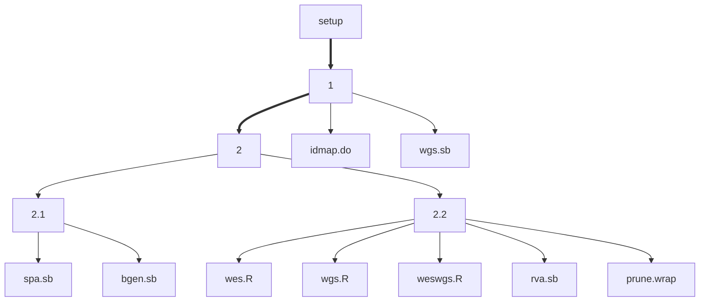

# INTERVAL analysis

## Programs

| Sequence | Filename  | Description           |
| ---------|---------- | --------------------- |
| 1        | weswgs.sh | WES/WGS preprocessing |
| 2.1      | spa.sh    | Single-point analysis |
| 2.2      | rva.sh    | Rare-variant analysis |

The hierachy of the scripts is as follows,

## Variant lists

INTERVAL variant lists and results submitted centrally are described in [variantlists.md](variantlists.md).
